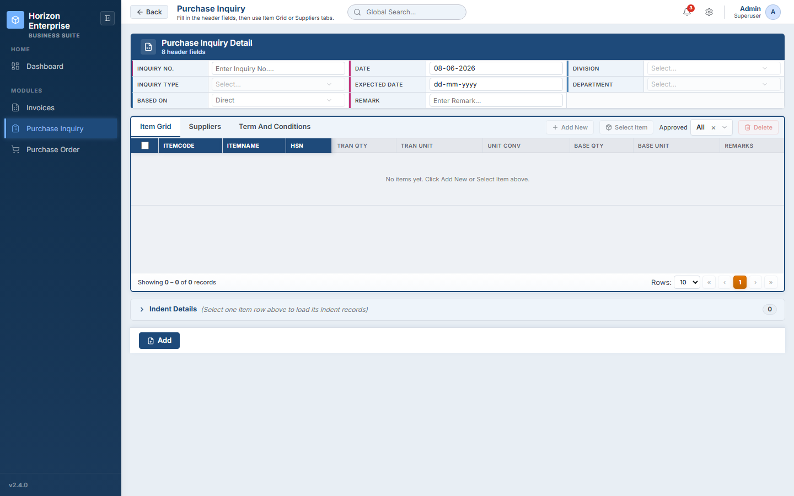

# Purchase Inquiry — API Reference
## Horizon Enterprise IMS

**Module:** Purchase Inquiry (`/purchase-inquiry`)  
**Frontend:** React 19 SPA  
**Backend:** ASP.NET ASMX Web Service  
**Document date:** 2026-06-08  
**Audience:** Backend team · QA team

---

## Screen



---

## Base URLs

| Alias | URL |
|---|---|
| **Primary** (`API_BASE_URL`) | `http://122.179.135.100:8095/IMS_LIVE/webservice/WsIMS.asmx` |
| **REST Gateway** (`API_BASE_URL_IMS`) | `http://122.179.135.100:8095/IMS_LIVE` |

> All GET calls go to the primary base URL. Indent summary and Save go to the REST gateway.

---

## Shared Request Defaults

| Constant | Value |
|---|---|
| `DEFAULT_LOGIN_ID` | `1` |
| `DEFAULT_COMPANY_ID` | `1` |
| `PI_CONFIG.DIVISION_YEAR_ID` | `2` |
| `PI_CONFIG.CONFIG_YEAR_ID` | `2` |
| `PI_CONFIG.FORM_TAG` | `"INQ"` |
| `PI_CONFIG.TRAN_BOOK` | `"PURINQUIRY"` |
| `PI_CONFIG.RB_MASTER` | `"RB_PurInquiryMst"` |
| `PI_CONFIG.RB_DETAIL` | `"RB_PurInquiryDet"` |

---

## API Load Sequence

```
PAGE MOUNT (all in parallel)
 ├── fetchHeaderMeta()
 │    ├── [4.1] FN_Fetch_Data → Fn_Fetch_RBDetailByRBCode (RB_PurInquiryMst) → RBID
 │    └── in parallel:
 │         ├── [4.2] GetDetailColData (header RBID) → headerColumns
 │         ├── [4.3] FN_Fetch_Data → Fn_tbl_FetchUserWsDivision → divisionOptions
 │         └── [4.4] FN_Fetch_Data → Pr_Fetch_DepartmentData_IMS → departmentOptions
 │
 └── fetchDetailMeta()
      ├── [4.5] FN_Fetch_Data → Fn_Fetch_RBDetailByRBCode (RB_PurInquiryDet) → RBID
      └── [4.6] GetDetailColData (detail RBID) → allColumns + eventColumns

ON DIVISION CHANGE
 └── [4.8] FN_Fetch_Data → fn_tbl_ddl_Pur_Configuration → inquiryTypeOptions

ON DIVISION + CONFIG ID SET (BasedOn = Indent wise)
 └── [4.9] FN_Fetch_Data → Fn_Tbl_FetchPurchaseItemDetailTransWs4Web → indentOptions

ON "Add New" / fetchGridColumns()
 └── [4.7] GetFilterDetail (per dropdown col, parallel) → grid column dropdowns

ON "Select Item"
 ├── [4.10] FN_Fetch_Data → Fn_Fetch_RBDetailByRBCode (item picker RB) → RBID
 ├── [4.11] GetDetailColData (item picker RBID) → modal columns
 └── [4.12] FN_Fetch_Data → Fn_Tbl_FetchPurchaseItemDetailTransWs4Web → modal rows

ON INSERT (indent-wise)
 └── [4.13] POST /API/Values → Fn_tbl_FetchIndentSummaryItem4Inquiry → parent rows

ON "Select Supplier"
 └── [4.14] FN_Fetch_Data → Fn_tbl_FetchCustomerSupplierTranWs4Web → supplier list

ON SAVE
 └── [4.15] POST /API/TranFormSave/Post_RB_PurInquiryMst_Save
```

---

## API 4.1 — Fetch Header RB Metadata

**Endpoint:** `GET /FN_Fetch_Data`  
**When called:** On page mount inside `fetchHeaderMeta()`  
**Component:** `PurchaseInquiryPage` → `usePurchaseInquiry.fetchHeaderMeta()`

### Request

```
GET http://122.179.135.100:8095/IMS_LIVE/webservice/WsIMS.asmx/FN_Fetch_Data
  ?ObjType=2
  &ObjName=Fn_Fetch_RBDetailByRBCode
  &JSon=[{"prmRBCode":"RB_PurInquiryMst"}]
  &p_ErrCode=-1
  &p_ErrMsg=
```

| Parameter | Type | Value | Notes |
|---|---|---|---|
| `ObjType` | number | `2` | SP execution mode |
| `ObjName` | string | `Fn_Fetch_RBDetailByRBCode` | `PI_CONFIG.SP_RB_META` |
| `JSon` | string (JSON array) | `[{"prmRBCode":"RB_PurInquiryMst"}]` | RB board code |
| `p_ErrCode` | number | `-1` | Output error sentinel |
| `p_ErrMsg` | string | `""` | Output error message |

### Response

```json
{
  "Table": [
    {
      "RBID": 45,
      "SaveProcName": "Pr_Save_PurInquiryMst"
    }
  ]
}
```

| Field | Type | Used for |
|---|---|---|
| `RBID` | number | Passed as `prmMasterID` to all subsequent `GetDetailColData` calls for master |
| `SaveProcName` | string | Stored in `localStorage["piHeaderMeta"]` — used in the save payload |

**Why:** Resolves the numeric RBID from the string RB board code so header column definitions can be fetched.

---

## API 4.2 — Fetch Header Column Definitions

**Endpoint:** `GET /GetDetailColData`  
**When called:** Immediately after 4.1 resolves, in parallel with 4.3 and 4.4  
**Component:** `usePurchaseInquiry.fetchHeaderMeta()`

### Request

```
GET .../GetDetailColData?prmMasterID=45&prmLoginID=1
```

| Parameter | Type | Value |
|---|---|---|
| `prmMasterID` | number | `RBID` from API 4.1 |
| `prmLoginID` | number | `1` |

### Response

```json
{
  "Links": [
    {
      "ColName": "TranCode",
      "DisplayName": "Inquiry No.",
      "ColCtrlType": 1,
      "ColDataType": "varchar(50)",
      "IsVisible": true,
      "IsEditAllow": false,
      "IsFreezeReq": 1,
      "ObjDetID": 201
    },
    {
      "ColName": "DivisionID",
      "DisplayName": "Division",
      "ColCtrlType": 4,
      "ColDataType": "numeric(18,0)",
      "IsVisible": true,
      "IsEditAllow": true,
      "IsFreezeReq": 0,
      "ObjDetID": 202
    }
  ]
}
```

| Field | Type | Used for |
|---|---|---|
| `ColName` | string | Field key — matched against `PI_HEADER_FILTERS` |
| `DisplayName` | string | Field label in the header panel |
| `ColCtrlType` | number | `1`=TextBox, `2`=Date, `4`=Dropdown, `9`=Textarea |
| `ColDataType` | string | Row seed default: `numeric`→`0`, `varchar`→`""`, `datetime`→`null` |
| `IsVisible` | bool/int | Hidden columns excluded from panel |
| `IsEditAllow` | bool/int | Whether field is editable |
| `IsFreezeReq` | bool/int | Pinned/frozen column flag |
| `ObjDetID` | number | Used as `prmFilterParameterName` in `GetFilterDetail` |

**Why:** Provides header field definitions — used to sync `FilterColName` and `DisplayName` with `PI_HEADER_FILTERS`.

---

## API 4.3 — Fetch Division Options

**Endpoint:** `GET /FN_Fetch_Data`  
**When called:** In parallel with 4.2 during `fetchHeaderMeta()`  
**Component:** `usePurchaseInquiry.fetchHeaderMeta()`

### Request

```
GET .../FN_Fetch_Data
  ?ObjType=2
  &ObjName=Fn_tbl_FetchUserWsDivision
  &JSon=[{"prmUserID":1,"prmCompanyID":1,"prmYearID":2}]
  &p_ErrCode=-1
  &p_ErrMsg=
```

| JSon Field | Type | Value |
|---|---|---|
| `prmUserID` | number | `1` (`DEFAULT_LOGIN_ID`) |
| `prmCompanyID` | number | `1` (`DEFAULT_COMPANY_ID`) |
| `prmYearID` | number | `2` (`PI_CONFIG.DIVISION_YEAR_ID`) |

### Response

```json
{
  "Table": [
    { "DivisionID": 1, "DivisionName": "Head Office" },
    { "DivisionID": 3, "DivisionName": "Mumbai Branch" }
  ]
}
```

| Field | Type | Used for |
|---|---|---|
| `DivisionID` | number | Dropdown option value |
| `DivisionName` | string | Dropdown option label |

**Why:** Populates the Division dropdown in the PI header filter panel.

---

## API 4.4 — Fetch Department Options

**Endpoint:** `GET /FN_Fetch_Data`  
**When called:** In parallel with 4.2 and 4.3 during `fetchHeaderMeta()`  
**Component:** `usePurchaseInquiry.fetchHeaderMeta()`

### Request

```
GET .../FN_Fetch_Data
  ?ObjType=1
  &ObjName=Pr_Fetch_DepartmentData_IMS
  &JSon=[{"PrmDeptID":0}]
  &p_ErrCode=-1
  &p_ErrMsg=
```

| JSon Field | Type | Value | Notes |
|---|---|---|---|
| `PrmDeptID` | number | `0` | `0` = fetch all departments |

### Response

```json
{
  "Table": [
    { "DepartmentID": 1, "DepartmentName": "Purchase" },
    { "DepartmentID": 2, "DepartmentName": "Stores" }
  ]
}
```

| Field | Type | Used for |
|---|---|---|
| `DepartmentID` | number | Dropdown option value |
| `DepartmentName` | string | Dropdown option label |

**Why:** Populates the Department dropdown in the PI header filter panel.

---

## API 4.5 — Fetch Detail RB Metadata

**Endpoint:** `GET /FN_Fetch_Data`  
**When called:** On page mount via `fetchDetailMeta()`, concurrently with `fetchHeaderMeta()`  
**Component:** `PurchaseInquiryPage` → `usePurchaseInquiry.fetchDetailMeta()`

### Request

```
GET .../FN_Fetch_Data
  ?ObjType=2
  &ObjName=Fn_Fetch_RBDetailByRBCode
  &JSon=[{"prmRBCode":"RB_PurInquiryDet"}]
  &p_ErrCode=-1
  &p_ErrMsg=
```

### Response

```json
{
  "Table": [
    {
      "RBID": 46,
      "SaveProcName": "Pr_Save_PurInquiryDet"
    }
  ]
}
```

| Field | Type | Used for |
|---|---|---|
| `RBID` | number | Passed as `prmMasterID` to `GetDetailColData` for the item grid |
| `SaveProcName` | string | Stored in `localStorage["piEntryMeta"]` — used in save payload |

**Why:** Resolves the detail RBID for item grid column definitions and save proc name.

---

## API 4.6 — Fetch Detail Column Definitions

**Endpoint:** `GET /GetDetailColData`  
**When called:** Immediately after 4.5 resolves  
**Component:** `usePurchaseInquiry.fetchDetailMeta()` → `loadRbDetailGridMeta()`

### Request

```
GET .../GetDetailColData?prmMasterID=46&prmLoginID=1
```

### Response — same shape as API 4.2

Key columns typically returned:

```json
{
  "Links": [
    { "ColName": "ItemID",      "ColCtrlType": 4, "IsEventReq": 1, "ColDataType": "numeric(18,0)", "ObjDetID": 301 },
    { "ColName": "ItemCode",    "ColCtrlType": 1, "IsEventReq": 1, "ColDataType": "varchar(50)",   "ObjDetID": 302 },
    { "ColName": "TranQty",     "ColCtrlType": 1, "IsEventReq": 1, "ColDataType": "numeric(18,3)", "ObjDetID": 303 },
    { "ColName": "BaseQty",     "ColCtrlType": 1, "IsEventReq": 1, "ColDataType": "numeric(18,3)", "ObjDetID": 304 },
    { "ColName": "UnitConvRate","ColCtrlType": 1, "IsEventReq": 1, "ColDataType": "numeric(18,6)", "ObjDetID": 305 },
    { "ColName": "TranRate",    "ColCtrlType": 1, "IsEventReq": 1, "ColDataType": "numeric(18,3)", "ObjDetID": 306 },
    { "ColName": "TranUnit",    "ColCtrlType": 4, "IsEventReq": 1, "ColDataType": "numeric(18,0)", "ObjDetID": 307 }
  ]
}
```

| Field | Used for |
|---|---|
| `ColName` + `ColDataType` | Extracted to form `allColumns` — used to seed blank row defaults |
| `IsEventReq` / `IsEventCol` | `1` = tabbing this cell fires a server event; builds `eventColumns` Set |
| `ObjDetID` | Key for `GetFilterDetail` dropdown fetch per column |

> Fallback `eventColumns` if none flagged: `['ItemID','ItemCode','TranQty','BaseQty','UnitConvRate','TranRate','TranUnit']`

**Why:** Defines all item grid columns and establishes which columns trigger server-side calculation on Tab.

---

## API 4.7 — Fetch Item Grid Dropdown Options

**Endpoint:** `GET /GetFilterDetail`  
**When called:** On `fetchGridColumns(divisionID)` — called on page load when `allColumns` populates, or on first "Add New"  
**Component:** `usePurchaseInquiry.fetchGridColumns()` → `fetchDropdownOptions()` in `gridUtils.js`

One call per column where `ColCtrlType === 4`, all in parallel.

### Request

```
GET .../GetFilterDetail
  ?prmMasterID=46
  &prmFilterParameterName=307
  &prmCboMode=C
  &prmFuncCode=RB_PurInquiryDet
  &prmDivisionID=3
  &prmLoginID=1
```

| Parameter | Type | Value | Notes |
|---|---|---|---|
| `prmMasterID` | number | detail RBID (from 4.5) | |
| `prmFilterParameterName` | number | `ObjDetID` of the column | |
| `prmCboMode` | string | `"C"` | Column mode — `CBO_MODE.COLUMN` |
| `prmFuncCode` | string | `"RB_PurInquiryDet"` | `PI_CONFIG.RB_DETAIL` |
| `prmDivisionID` | number | currently selected DivisionID | Scopes dropdown data to division |
| `prmLoginID` | number | `1` | |

### Response

```json
{
  "Links": [
    {
      "FilterCtrlValueCol": "UnitID",
      "FilterCtrlDisplayCol": "UnitName",
      "UnitID": 1,
      "UnitName": "Kg"
    },
    {
      "FilterCtrlValueCol": "UnitID",
      "FilterCtrlDisplayCol": "UnitName",
      "UnitID": 2,
      "UnitName": "Pcs"
    }
  ]
}
```

| Field | Type | Used for |
|---|---|---|
| `FilterCtrlValueCol` | string | Points to the key field for the option **value** |
| `FilterCtrlDisplayCol` | string | Points to the key field for the option **label** |
| *(data fields)* | any | Actual option data — key names determined by `FilterCtrlValueCol`/`FilterCtrlDisplayCol`. Fallback: `IDNumber`→`Name` |

**Why:** Populates dropdown options for editable dropdown cells in the item entry grid.

---

## API 4.8 — Fetch Inquiry Types (Cascade: Division changes)

**Endpoint:** `GET /FN_Fetch_Data`  
**When called:** When user changes the Division dropdown — `handleFilterChange('DivisionID', val)`  
**Component:** `PurchaseInquiryPage.handleFilterChange()` → `usePurchaseInquiry.fetchInquiryTypes(divisionId)`

### Request

```
GET .../FN_Fetch_Data
  ?ObjType=2
  &ObjName=fn_tbl_ddl_Pur_Configuration
  &JSon=[{
    "PrmCompanyId":1,
    "PrmDivisionId":3,
    "PrmYearId":2,
    "PrmUserId":1,
    "PrmFormTag":"INQ",
    "PrmRefType":""
  }]
  &p_ErrCode=-1
  &p_ErrMsg=
```

| JSon Field | Type | Value | Notes |
|---|---|---|---|
| `PrmCompanyId` | number | `1` | `DEFAULT_COMPANY_ID` |
| `PrmDivisionId` | number | selected DivisionID | Changes on each Division pick |
| `PrmYearId` | number | `2` | `PI_CONFIG.CONFIG_YEAR_ID` |
| `PrmUserId` | number | `1` | `DEFAULT_LOGIN_ID` |
| `PrmFormTag` | string | `"INQ"` | `PI_CONFIG.FORM_TAG` — filters to inquiry types only |
| `PrmRefType` | string | `""` | Empty |

### Response

```json
{
  "Table": [
    { "ConfigurationId": 5, "Name": "Standard Inquiry" },
    { "ConfigurationId": 6, "Name": "Urgent Inquiry" }
  ]
}
```

| Field | Type | Used for |
|---|---|---|
| `ConfigurationId` | number | Dropdown option value |
| `Name` | string | Dropdown option label |

**Why:** Cascade — refreshes Inquiry Type dropdown options whenever Division changes. Clears to empty if Division is `0`.

---

## API 4.9 — Fetch Indents

**Endpoint:** `GET /FN_Fetch_Data`  
**When called:** When Division + ConfigID are both set (and either changes) with BasedOn = Indent wise  
**Component:** `usePurchaseInquiry.fetchIndents({ divisionId, configId, tranDate, supplierId, frmOption })`

### Request

```
GET .../FN_Fetch_Data
  ?ObjType=2
  &ObjName=Fn_Tbl_FetchPurchaseItemDetailTransWs4Web
  &JSon=[{
    "prmDivisionID":3,
    "prmYearID":2,
    "prmLoginID":1,
    "prmTranDate":"08-Jun-2026",
    "prmConfigID":5,
    "prmSupplierID":0,
    "prmTranBook":"PURINQUIRY",
    "prmFrmOption":0
  }]
  &p_ErrCode=-1
  &p_ErrMsg=
```

| JSon Field | Type | Value | Notes |
|---|---|---|---|
| `prmDivisionID` | number | selected DivisionID | |
| `prmYearID` | number | `2` | `PI_CONFIG.CONFIG_YEAR_ID` |
| `prmLoginID` | number | `1` | `DEFAULT_LOGIN_ID` |
| `prmTranDate` | string | `"08-Jun-2026"` | `dd-Mon-yyyy` format via `formatPiTranDate()` |
| `prmConfigID` | number | selected ConfigurationId | Inquiry Type |
| `prmSupplierID` | number | `0` | From header; default `0` |
| `prmTranBook` | string | `"PURINQUIRY"` | `PI_CONFIG.TRAN_BOOK` |
| `prmFrmOption` | number | `0` | `PI_CONFIG.INDENT_FRM_OPTION` |

### Response

```json
{
  "Table": [
    {
      "IndentID": 201,
      "IndentNo": "IND/2026/001",
      "IndentDate": "2026-05-20T00:00:00",
      "ItemName": "Stainless Steel Pipe",
      "IndentQty": 100,
      "TranQty": 0,
      "Unit": "Kg"
    }
  ]
}
```

| Field | Type | Used for |
|---|---|---|
| `IndentID` | number | Dropdown value key |
| `IndentNo` | string | Dropdown label |
| *(all fields)* | any | Full row stored in `indentOptions` state |

**Why:** Provides the list of available indents when the PI is indent-based (`BasedOnID = "2"`).

---

## API 4.10 — Fetch Item Picker RB Metadata

**Endpoint:** `GET /FN_Fetch_Data`  
**When called:** User clicks "Select Item" button  
**Component:** `PurchaseInquiryPage.handleSelectItem()`

### Request

```
GET .../FN_Fetch_Data
  ?ObjType=2
  &ObjName=Fn_Fetch_RBDetailByRBCode
  &JSon=[{"prmRBCode":"RB_PurInqSelOnlyItem"}]
  &p_ErrCode=-1
  &p_ErrMsg=
```

| JSon Field | Value | Notes |
|---|---|---|
| `prmRBCode` | `"RB_PurInqSelOnlyItem"` | `PI_CONFIG.RB_ITEM_PICKER_DIRECT` when `BasedOnID = "0"` |
| `prmRBCode` | `"RB_PurInqSelIndtItem"` | `PI_CONFIG.RB_ITEM_PICKER_INDENT` when `BasedOnID = "2"` |

### Response — same shape as API 4.1

`RBID` used for the subsequent column fetch (4.11).

**Why:** Resolves the RBID for the item picker modal — RB code differs based on whether Direct or Indent-wise flow.

---

## API 4.11 — Fetch Item Picker Column Definitions

**Endpoint:** `GET /GetDetailColData`  
**When called:** Immediately after 4.10 resolves  
**Component:** `PurchaseInquiryPage.handleSelectItem()`

### Request

```
GET .../GetDetailColData?prmMasterID=<pickerRBID>&prmLoginID=1
```

### Response — same shape as API 4.2

Columns built with `filterable: false, allEditable: false` (read-only modal grid).

**Why:** Defines the columns shown in the item picker modal.

---

## API 4.12 — Fetch Item Picker Rows

**Endpoint:** `GET /FN_Fetch_Data`  
**When called:** After columns are resolved in `handleSelectItem()`  
**Component:** `PurchaseInquiryPage.handleSelectItem()`

### Request

```
GET .../FN_Fetch_Data
  ?ObjType=2
  &ObjName=Fn_Tbl_FetchPurchaseItemDetailTransWs4Web
  &JSon=[{
    "prmDivisionID":3,
    "prmYearID":2,
    "prmLoginID":1,
    "prmTranDate":"08-Jun-2026",
    "prmConfigID":5,
    "prmSupplierID":0,
    "prmTranBook":"PURINQUIRY",
    "prmFrmOption":0
  }]
  &p_ErrCode=-1
  &p_ErrMsg=
```

| JSon Field | Type | Value | Notes |
|---|---|---|---|
| `prmDivisionID` | number | from header | Guard: alert if 0 |
| `prmYearID` | number | `2` | `PI_CONFIG.CONFIG_YEAR_ID` |
| `prmLoginID` | number | `1` | |
| `prmTranDate` | string | `"dd-Mon-yyyy"` | Formatted from header TranDate |
| `prmConfigID` | number | selected ConfigID | `0` if not set |
| `prmSupplierID` | number | from header | `0` if not set |
| `prmTranBook` | string | `"PURINQUIRY"` | |
| `prmFrmOption` | number | `0` or `2` | `BasedOnID` cast to number |

### Response

```json
{
  "Table": [
    {
      "ItemID": 501,
      "ItemCode": "SS-PIPE-001",
      "ItemName": "Stainless Steel Pipe",
      "IndentQty": 100,
      "Unit": "Kg",
      "IndentNo": "IND/2026/001",
      "IndentDate": "2026-05-20T00:00:00",
      "ChildFKey": 501
    }
  ]
}
```

Rows displayed in the item picker modal. Selected rows mapped onto blank grid rows via `mapPickerToItemRow()`.

**Why:** Provides the selectable item list for the PI item picker modal (Direct or Indent-wise).

---

## API 4.13 — Fetch Indent Summary (REST Gateway)

**Endpoint:** `POST /API/Values`  
**When called:** After user selects indent-wise items and clicks Insert — `handleInsertItems()` when `BasedOnID === "2"`  
**Component:** `PurchaseInquiryPage.handleInsertItems()`

### Request

```
POST http://122.179.135.100:8095/IMS_LIVE/API/Values
Content-Type: application/json
```

```json
{
  "ObjType": 2,
  "ObjName": "Fn_tbl_FetchIndentSummaryItem4Inquiry",
  "JSon": [
    {
      "prmJSon": [
        { "ItemID": 501, "IndentNo": "IND/2026/001", "IndentQty": 100 },
        { "ItemID": 502, "IndentNo": "IND/2026/002", "IndentQty": 50 }
      ]
    }
  ],
  "p_ErrCode": -1,
  "p_ErrMsg": ""
}
```

| Field | Type | Value | Notes |
|---|---|---|---|
| `ObjType` | number | `2` | |
| `ObjName` | string | `Fn_tbl_FetchIndentSummaryItem4Inquiry` | `PI_CONFIG.SP_INDENT_SUMMARY` |
| `JSon` | array | `[{ prmJSon: [...selectedRows] }]` | Selected indent rows with internal `id` stripped |
| `p_ErrCode` | number | `-1` | |
| `p_ErrMsg` | string | `""` | |

### Response

```json
{
  "Table": [
    {
      "ItemID": 501,
      "ItemName": "Stainless Steel Pipe",
      "TranQty": 100,
      "Unit": "Kg",
      "IndentNo": "IND/2026/001",
      "IndentDate": "2026-05-20T00:00:00",
      "ChildFKey": 501
    }
  ]
}
```

| Field | Type | Used for |
|---|---|---|
| `ItemID` | number | Parent row identifier; children matched via `ChildFKey === parent.ItemID` |
| *(all fields)* | any | Spread onto parent item grid rows |

**Why:** Aggregates selected indent rows into summary parent rows for the item grid; also builds the collapsible child row mapping.

---

## API 4.14 — Fetch Supplier List (Supplier Modal)

**Endpoint:** `GET /FN_Fetch_Data`  
**When called:** User clicks "Select Supplier" button  
**Component:** `PurchaseInquiryPage.handleSelectSupplier()`

### Request

```
GET .../FN_Fetch_Data
  ?ObjType=2
  &ObjName=Fn_tbl_FetchCustomerSupplierTranWs4Web
  &JSon=[{
    "PrmDivisionId":3,
    "PrmLoginId":1,
    "PrmYearId":2,
    "PrmPartyType":"S"
  }]
  &p_ErrCode=-1
  &p_ErrMsg=
```

| JSon Field | Type | Value | Notes |
|---|---|---|---|
| `PrmDivisionId` | number | selected DivisionID | Guard: alert if `0` |
| `PrmLoginId` | number | `1` | `DEFAULT_LOGIN_ID` |
| `PrmYearId` | number | `2` | `PI_CONFIG.CONFIG_YEAR_ID` |
| `PrmPartyType` | string | `"S"` | `PI_CONFIG.SUPPLIER_PARTY_TYPE` — `"S"` = Supplier |

### Response

```json
{
  "Table": [
    {
      "SupplierID": 301,
      "SupplierName": "ABC Suppliers Ltd",
      "SuppAddress": "123 Industrial Area, Andheri",
      "City": "Mumbai",
      "ContactNo": "9876543210",
      "SrNo": 1
    }
  ]
}
```

| Field | Type | Used for |
|---|---|---|
| `SupplierID` | number | Row ID and supplier grid value |
| `SupplierName` | string | Supplier grid "Supplier Name" column |
| `SuppAddress` | string | Supplier grid "Address" column (fallback: `Address`) |
| `City` | string | Supplier grid "City" column |
| `ContactNo` | string | Supplier grid "Mobile No." column (fallback: `MobileNo`) |

**Why:** Provides the supplier list for the Supplier picker modal; selected suppliers are added to the Suppliers tab grid.

---

## API 4.15 — Save Purchase Inquiry (REST Gateway)

**Endpoint:** `POST /API/TranFormSave/Post_RB_PurInquiryMst_Save`  
**When called:** User clicks Save (or Save & Print)  
**Component:** `PurchaseInquiryPage.handleSave()`

### Request

```
POST http://122.179.135.100:8095/IMS_LIVE/API/TranFormSave/Post_RB_PurInquiryMst_Save
Content-Type: application/json
```

```json
{
  "prmStrMstJSON": "[{\"TranCode\":\"\",\"TranDate\":\"2026-06-08\",\"ConfigID\":5,\"ExpectedDate\":null,\"DivisionID\":3,\"DeptID\":1,\"BasedOnID\":\"0\",\"Remarks\":\"\",\"CompanyID\":1,\"YearID\":2,\"LoginID\":1,\"IDNumber\":0}]",
  "prmStrDetJSON": "[{\"ItemID\":501,\"ItemCode\":\"SS-PIPE-001\",\"TranQty\":100,\"TranUnit\":1,\"LoginID\":1}]",
  "prmStrIndtDetJSON": "[{\"ItemID\":501,\"IndentNo\":\"IND/2026/001\",\"IndentQty\":100,\"LoginID\":1}]"
}
```

**Master row fields (`prmStrMstJSON`):**

| Field | Type | Example | Notes |
|---|---|---|---|
| `TranCode` | string | `""` | Auto-generated by backend if empty |
| `TranDate` | string | `"2026-06-08"` | ISO date from header |
| `ConfigID` | number | `5` | Selected Inquiry Type (`ConfigurationId`) |
| `ExpectedDate` | string / null | `null` | From header |
| `DivisionID` | number | `3` | |
| `DeptID` | number | `1` | Selected Department |
| `BasedOnID` | string | `"0"` | `"0"` = Direct, `"2"` = Indent wise |
| `Remarks` | string | `""` | From header |
| `CompanyID` | number | `1` | `DEFAULT_COMPANY_ID` |
| `YearID` | number | `2` | `PI_CONFIG.DIVISION_YEAR_ID` |
| `LoginID` | number | `1` | `DEFAULT_LOGIN_ID` |
| `IDNumber` | number | `0` | `0` = new entry; route `:id` value = amend |

**Detail row fields (`prmStrDetJSON`):**

| Field | Type | Notes |
|---|---|---|
| All item grid columns | any | Internal `id` field stripped; `LoginID` injected per row |

**Indent detail fields (`prmStrIndtDetJSON`):**

| Field | Type | Notes |
|---|---|---|
| All indent child rows | any | From `childRowsMap`; internal `id` stripped; `LoginID` injected |

### Response

```json
{ "ok": true, "message": "Saved successfully." }
```

If `!res.ok`, error message from `result?.message` is thrown. Success triggers an alert dialog.

**Why:** Creates or amends a purchase inquiry on the server with all three data layers: master header, item detail rows, and indent detail children.

---

## Summary Table

| # | Endpoint | Method | SP / Function | Trigger |
|---|---|---|---|---|
| 4.1 | `/FN_Fetch_Data` | GET | `Fn_Fetch_RBDetailByRBCode` (RB_PurInquiryMst) | Page mount |
| 4.2 | `/GetDetailColData` | GET | — | After 4.1 resolves |
| 4.3 | `/FN_Fetch_Data` | GET | `Fn_tbl_FetchUserWsDivision` | Page mount (parallel) |
| 4.4 | `/FN_Fetch_Data` | GET | `Pr_Fetch_DepartmentData_IMS` | Page mount (parallel) |
| 4.5 | `/FN_Fetch_Data` | GET | `Fn_Fetch_RBDetailByRBCode` (RB_PurInquiryDet) | Page mount (parallel) |
| 4.6 | `/GetDetailColData` | GET | — | After 4.5 resolves |
| 4.7 | `/GetFilterDetail` | GET | — | On `fetchGridColumns()` — per dropdown col |
| 4.8 | `/FN_Fetch_Data` | GET | `fn_tbl_ddl_Pur_Configuration` | Division dropdown change |
| 4.9 | `/FN_Fetch_Data` | GET | `Fn_Tbl_FetchPurchaseItemDetailTransWs4Web` | Division + ConfigID set |
| 4.10 | `/FN_Fetch_Data` | GET | `Fn_Fetch_RBDetailByRBCode` (item picker RB) | "Select Item" click |
| 4.11 | `/GetDetailColData` | GET | — | After 4.10 resolves |
| 4.12 | `/FN_Fetch_Data` | GET | `Fn_Tbl_FetchPurchaseItemDetailTransWs4Web` | After 4.11 resolves |
| 4.13 | `/API/Values` | **POST** | `Fn_tbl_FetchIndentSummaryItem4Inquiry` | Insert (indent-wise) |
| 4.14 | `/FN_Fetch_Data` | GET | `Fn_tbl_FetchCustomerSupplierTranWs4Web` | "Select Supplier" click |
| 4.15 | `/API/TranFormSave/Post_RB_PurInquiryMst_Save` | **POST** | — | Save button click |
